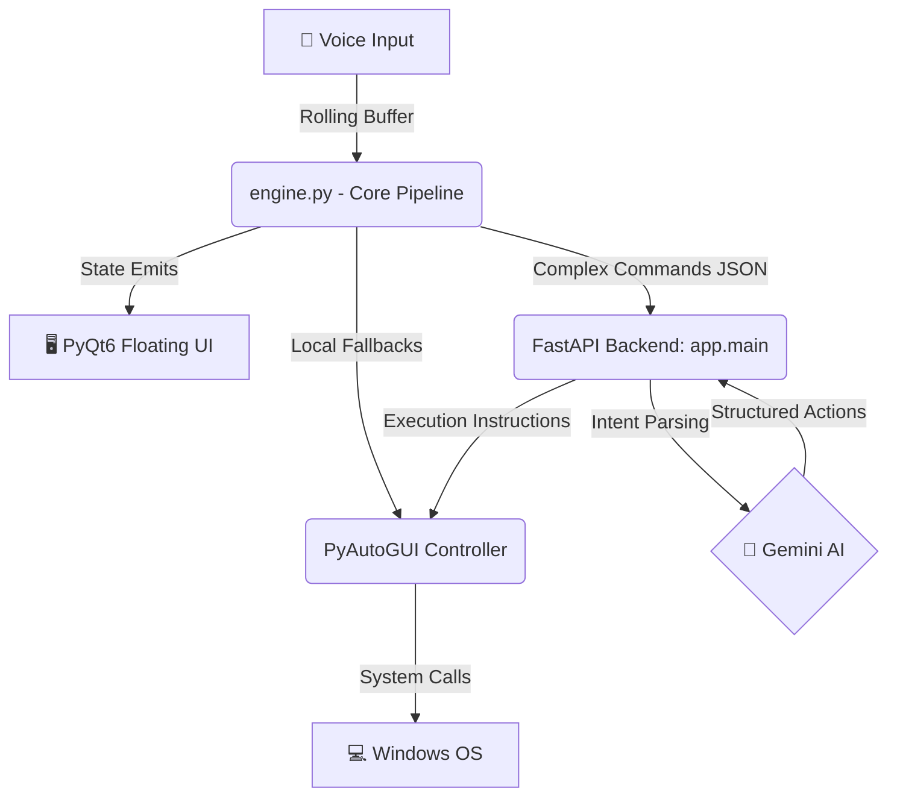

# Goofy AI — System-Wide Voice OS Agent

Welcome to **Goofy**, the professional, system-wide Voice OS Agent.

Goofy has evolved into a full-scale local AI agent capable of controlling your entire operating system using a seamless, zero-latency voice interface. 

---

## 🎯 Product Requirements Document (PRD)

### 1. Vision & Purpose
To build a professional, "God-Mode" AI assistant that sits transparently on top of the user's OS, bridging the gap between natural language intention and physical computer execution. Unlike Siri or Cortana which are sandboxed, Goofy leverages deep OS hooks and native execution to actually *do the work for you*.

### 2. Core Capabilities
- **Zero-Latency Background Engine**: A continuous rolling-buffer audio pipeline using Google STT that captures commands instantly without deadlocks.
- **System-Wide Macros (PyAutoGUI)**: The ability to switch windows, adjust system volume, launch desktop apps, type text into any active window, and take screenshots across the entire OS.
- **Floating UI Aesthetic**: A stunning, borderless, glassmorphic PyQt6 orb that slides up smoothly from the system tray to provide immediate visual feedback (Listening → Processing → Success/Error) without interrupting the user's workflow.

### 3. System Architecture

Goofy is built on a distributed, micro-service architecture running entirely on `localhost`:



#### 3.1 The Three Pillars
1. **The Core Engine (`desktop/main.py` & `engine.py`)**: The brain stem. Runs a continuous background thread monitoring the microphone. Handles the PyQt UI state machine.
2. **The End-Effectors (`PyAutoGUI`)**: The hands. Executes physical actions on the computer. Controls the mouse, keyboard, and system processes.
3. **The AI Brain (`backend/`)**: The frontal lobe. A robust FastAPI server running locally that receives complex transcripts and uses Google's Gemini models to extract structured JSON intents (`system.open_app`, `system.screenshot`).

---

## 🚀 Installation & Setup

### 1. Prerequisites
- Python 3.11+

### 2. Full Setup

```bash
# 1. Setup the AI Brain
cd backend
pip install -r requirements.txt
copy .env.example .env
# Edit .env and add your GEMINI_API_KEY

# 2. Setup the OS Agent
cd ../desktop
python -m venv venv
.\venv\Scripts\activate
pip install -r requirements.txt
```

### 3. How to Run (The Professional Way)

You do **not** need to manually start terminals anymore.

1. Navigate to `D:\goofy\desktop` in your File Explorer.
2. Double-click the **`run_goofy.bat`** file.

**What the `.bat` file does automatically:**
1. Assassinates all ghost/duplicate Python background processes.
2. Launches your FastAPI AI Brain invisibly in the background.
3. Launches the Goofy PyQt6 Engine in the System Tray.

You will see the Goofy UI slide up from the bottom of your screen and announce **"Goofy is Online!"**. 

### 4. How to Use

Simply say:
- *"Hello Goofy, take a screenshot"*
- *"Hello Goofy, search for latest AI news"*
- *"Hello Goofy, scroll down"*

If the command succeeds, Goofy will chime happily and execute the action across your entire system!
